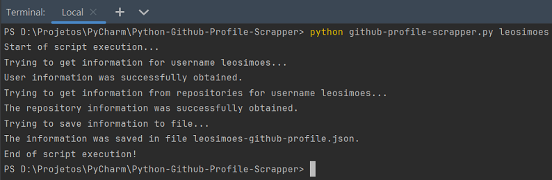

# Github Profile Scrapper
Autor: Leonardo Simões

Projeto de desenvolvimento de um script Python para criar um arquivo json com as informações do perfil de um usuário 
do Github e de seus repositórios.

As rotas da API do GitHub usadas foram:
- `https://api.github.com/users/<username>` para obter as informações gerais do perfil;
- `https://api.github.com/users/<username>/repos?page=<page_number>&per_page=<per_page>` para obter as informações dos repositórios.

O script deve ser executado pelo terminal com o comando `python github-profile-scrapper.py <username>`.

Obs.: 
- `<username>` deve ser substituído pelo nome do usuário do GitHub nas rotas da API e do comando do terminal;
- `<page_number>` na rota dos repositórios indica o número da página de consulta;
- `<per_page>` na rota dos repositórios indica o número de repositórios por página, deve ser menor ou igual a 100.

Um exemplo da execução do projeto:

