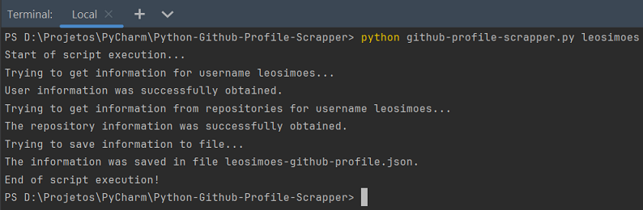

# Github Profile Scrapper
Author: Leonardo Simões

Project to develop a Python script to create a json file with a user's profile information
from Github and its repositories.

The GitHub API routes used were:
- `https://api.github.com/users/<username>` to obtain general profile information;
- `https://api.github.com/users/<username>/repos?page=<page_number>&per_page=<per_page>` to get repository information.

The script must be run through the terminal with the command `python github-profile-scrapper.py <username>`.

Note:
- `<username>` must be replaced with the GitHub username in the API and terminal command routes;
- `<page_number>` in the repositories route indicates the query page number;
- `<per_page>` in the repositories route indicates the number of repositories per page, it must be less than or equal to 100.

An example of project execution:

